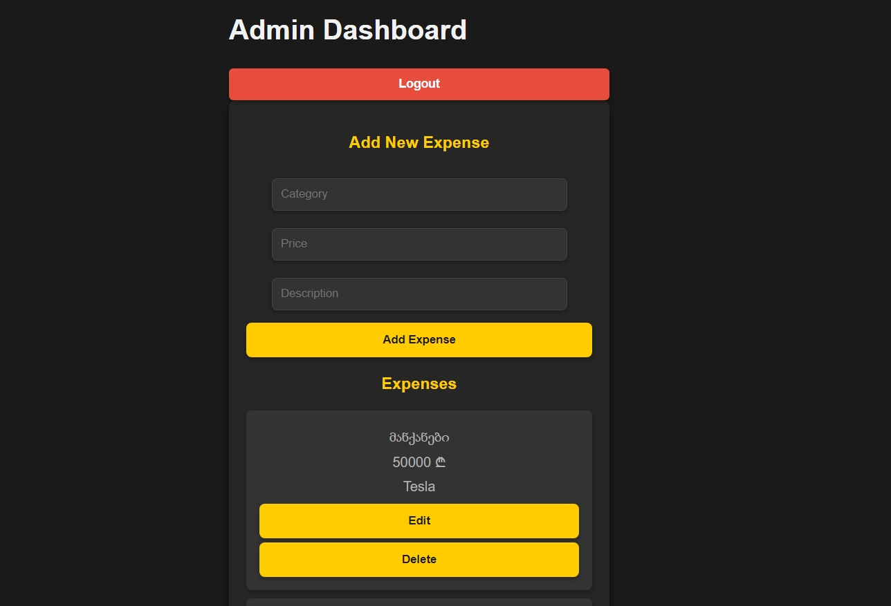

# Expense Management App

აპლიკაცია შექმნილია ხარჯების ორგანიზებისა და მართვისთვის. იგი უზრუნველყოფს სრულფასოვან CRUD ოპერაციებს, და ადმინისტრატორის პანელის ფუნქციონალს ავტორიზაციის სისტემით. Express.js და React.js გამოყენებულია ბექენდისა და ფრონტენდისთვის.

## 🛠 Features

➡️ მომხმარებლის ხარჯების მართვა
  - დამატება: ხარჯების მარტივად შეყვანა.
  - რედაქტირება: არსებული ხარჯების განახლება.
  - წაშლა: არასაჭირო მონაცემების ამოღება.
➡️ ავტორიზაცია და სესიის მართვა
  - JWT ტოკენები: მომხმარებლის უსაფრთხო შესვლა და წვდომის კონტროლი.
  - მონაცემთა ვალიდაცია: სერვერზე მონაცემების სისწორის შემოწმება.
➡️ ადმინისტრატორის პანელი
  - ხარჯების სრული კონტროლი ადმინისტრატორისთვის.
  - CRUD ოპერაციების ადმინისტრირება.
➡️ პაგინაცია
  - ხარჯების დათვალიერება გვერდების საშუალებით.

## ⚙️ Technologies Used

- **Backend**

  - Node.js
  - Express.js
  - jsonwebtoken (JWT)
  - dotenv (სერვერის კონფიგურაციისთვის)
  - nodemon (სერვერის ავტომატური რესტარტისთვის)

- **Frontend**

  - React.js
  - Axios (API მოთხოვნების განსახორციელებლად)
  - React Router (ნავიგაციისთვის)

- **Additional**
  - CSS Modules: UI-ს სტილების მენეჯმენტი
  - მონაცემთა ბაზა (MongoDB ).

